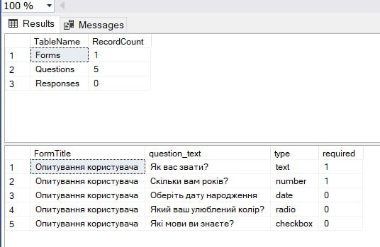

# Лабораторна робота №6

## Тема: Реалізація об’єктно-реляційного відображення

## Структура проєкту

```
flex-form/
├── src/
│   ├── dao/
│   │   ├── QuestionDAO.java
│   │   ├── FormDAO.java
│   │   └── ResponseDAO.java
│   ├── model/
│   │   ├── Question.java
│   │   ├── Form.java
│   │   └── Response.java
│   ├── Main.java
├── db/
│   └── init.sql
├── README.md
```

## SQL: Створення бази даних `init.sql`

```sql
CREATE DATABASE IF NOT EXISTS flexform;
USE flexform;

CREATE TABLE IF NOT EXISTS forms (
    id INT AUTO_INCREMENT PRIMARY KEY,
    title VARCHAR(255) NOT NULL
);

CREATE TABLE IF NOT EXISTS questions (
    id INT AUTO_INCREMENT PRIMARY KEY,
    form_id INT,
    text VARCHAR(255) NOT NULL,
    type ENUM('text', 'number', 'date', 'radio', 'checkbox') NOT NULL,
    required BOOLEAN DEFAULT FALSE,
    FOREIGN KEY (form_id) REFERENCES forms(id)
);

CREATE TABLE IF NOT EXISTS responses (
    id INT AUTO_INCREMENT PRIMARY KEY,
    question_id INT,
    answer TEXT,
    FOREIGN KEY (question_id) REFERENCES questions(id)
);
```

## Bean-класи

### Form.java

```java
package model;

public class Form {
    private int id;
    private String title;

    public Form(int id, String title) {
        this.id = id;
        this.title = title;
    }

    public Form(String title) {
        this.title = title;
    }

    public int getId() {
        return id;
    }

    public String getTitle() {
        return title;
    }
}
```

### Question.java

```java
package model;

public class Question {
    private int id;
    private int formId;
    private String text;
    private String type;
    private boolean required;

    public Question(int id, int formId, String text, String type, boolean required) {
        this.id = id;
        this.formId = formId;
        this.text = text;
        this.type = type;
        this.required = required;
    }

    public Question(int formId, String text, String type, boolean required) {
        this.formId = formId;
        this.text = text;
        this.type = type;
        this.required = required;
    }

    public int getId() {
        return id;
    }

    public int getFormId() {
        return formId;
    }

    public String getText() {
        return text;
    }

    public String getType() {
        return type;
    }

    public boolean isRequired() {
        return required;
    }
}
```

### Response.java

```java
package model;

public class Response {
    private int id;
    private int questionId;
    private String answer;

    public Response(int id, int questionId, String answer) {
        this.id = id;
        this.questionId = questionId;
        this.answer = answer;
    }

    public Response(int questionId, String answer) {
        this.questionId = questionId;
        this.answer = answer;
    }

    public int getId() {
        return id;
    }

    public int getQuestionId() {
        return questionId;
    }

    public String getAnswer() {
        return answer;
    }
}
```

## DAO-класи (приклад одного)

### FormDAO.java

```java
package dao;

import model.Form;
import java.sql.*;
import java.util.*;

public class FormDAO {
    private Connection connection;

    public FormDAO(Connection connection) {
        this.connection = connection;
    }

    public void insert(Form form) throws SQLException {
        PreparedStatement stmt = connection.prepareStatement("INSERT INTO forms (title) VALUES (?)");
        stmt.setString(1, form.getTitle());
        stmt.executeUpdate();
    }

    public List<Form> getAll() throws SQLException {
        List<Form> forms = new ArrayList<>();
        Statement stmt = connection.createStatement();
        ResultSet rs = stmt.executeQuery("SELECT * FROM forms");
        while (rs.next()) {
            forms.add(new Form(rs.getInt("id"), rs.getString("title")));
        }
        return forms;
    }
}
```

## Головний клас

### Main.java

```java
import dao.*;
import model.*;
import java.sql.*;

public class Main {
    public static void main(String[] args) throws Exception {
        Connection connection = DriverManager.getConnection("jdbc:mysql://localhost:3306/flexform", "root", "password");

        FormDAO formDAO = new FormDAO(connection);
        formDAO.insert(new Form("Опитування користувача"));

        for (Form form : formDAO.getAll()) {
            System.out.println("Форма: " + form.getTitle());
        }

        connection.close();
    }
}
```
## Запуск програми

1. Я імпортував базу даних, виконавши SQL-скрипт `db/init.sql` у середовищі MySQL (через консоль або MySQL Workbench).
2. Далі я скомпілював програму за допомогою команди:

```bash
 javac -cp .:mysql-connector-java-8.0.33.jar src/**/*.java
```

(на Windows замість `:` потрібно використовувати `;`):

```bash
 javac -cp .;mysql-connector-java-8.0.33.jar src/**/*.java
```

3. Після цього я запустив головний клас:

```bash
 java -cp .:mysql-connector-java-8.0.33.jar src/Main
```

або на Windows:

```bash
 java -cp .;mysql-connector-java-8.0.33.jar src/Main
```

4. Після запуску я побачив результати виконання в консолі, а також перевірив, що нові записи з'явилися в базі `flexform`.



## Висновки

У межах лабораторної робот було створено вебзастосунок Flex Form — систему створення онлайн-форм із використанням DAO. Реалізовано структуру бази даних, моделі об’єктів, класи доступу до даних і демонстраційну програму. Такий підхід забезпечує ізоляцію бізнес-логіки від деталей СКБД, гнучкість і масштабованість у проєктуванні веб-додатків.
