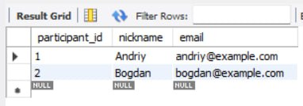
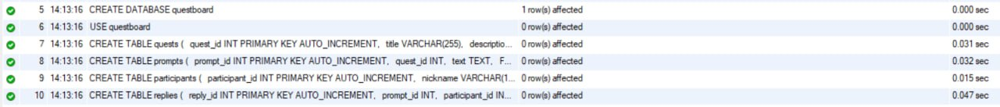

# Реалізація об’єктно-реляційного відображення

## 1. Створення бази даних MySQL

Було створено базу даних `test_db` у MySQL для зберігання даних.

```
CREATE DATABASE questboard;
USE questboard;

CREATE TABLE quests (
  quest_id INT PRIMARY KEY AUTO_INCREMENT,
  title VARCHAR(255),
  description TEXT
);

CREATE TABLE prompts (
  prompt_id INT PRIMARY KEY AUTO_INCREMENT,
  quest_id INT,
  text TEXT,
  FOREIGN KEY (quest_id) REFERENCES quests(quest_id)
);

CREATE TABLE participants (
  participant_id INT PRIMARY KEY AUTO_INCREMENT,
  nickname VARCHAR(100),
  email VARCHAR(100)
);

CREATE TABLE replies (
  reply_id INT PRIMARY KEY AUTO_INCREMENT,
  prompt_id INT,
  participant_id INT,
  response TEXT,
  FOREIGN KEY (prompt_id) REFERENCES prompts(prompt_id),
  FOREIGN KEY (participant_id) REFERENCES participants(participant_id)
);
```


## 2. Bean-клас

```
package model;

public class Employee {
    private int id;
    private String name;
    private String email;
    private String department;

    // Конструктори
    public Employee() {}

    public Employee(String name, String email, String department) {
        this.name = name;
        this.email = email;
        this.department = department;
    }

    // Геттери та сеттери
    public int getId() { return id; }
    public void setId(int id) { this.id = id; }

    public String getName() { return name; }
    public void setName(String name) { this.name = name; }

    public String getEmail() { return email; }
    public void setEmail(String email) { this.email = email; }

    public String getDepartment() { return department; }
    public void setDepartment(String department) { this.department = department; }
}


```


**Структура проєкту:**

```
.
├── lib
│   └── mysql-connector-j-8.4.0.jar 
└── src
    ├── dao                             
    │   ├── EmployeeDAO.java
    │   └── EmployeeDAOImpl.java
    ├── model                        
    │   └── Employee.java
    └── test                            
        └── Main.java


````

## 3. Реалізація DAO

```java
package dao;

import model.Employee;
import java.sql.*;
import java.util.*;

public class EmployeeDAOImpl implements EmployeeDAO {
    private Connection conn;

    public EmployeeDAOImpl(Connection conn) {
        this.conn = conn;
    }

    public void addEmployee(Employee employee) {
        try (PreparedStatement stmt = conn.prepareStatement(
            "INSERT INTO employees (name, email, department) VALUES (?, ?, ?)")) {
            stmt.setString(1, employee.getName());
            stmt.setString(2, employee.getEmail());
            stmt.setString(3, employee.getDepartment());
            stmt.executeUpdate();
        } catch (SQLException e) {
            e.printStackTrace();
        }
    }

    public Employee getEmployeeById(int id) {
        try (PreparedStatement stmt = conn.prepareStatement(
            "SELECT * FROM employees WHERE id = ?")) {
            stmt.setInt(1, id);
            ResultSet rs = stmt.executeQuery();
            if (rs.next()) {
                return extractEmployee(rs);
            }
        } catch (SQLException e) {
            e.printStackTrace();
        }
        return null;
    }

    public List<Employee> getAllEmployees() {
        List<Employee> list = new ArrayList<>();
        try (Statement stmt = conn.createStatement()) {
            ResultSet rs = stmt.executeQuery("SELECT * FROM employees");
            while (rs.next()) {
                list.add(extractEmployee(rs));
            }
        } catch (SQLException e) {
            e.printStackTrace();
        }
        return list;
    }

    public List<Employee> findByDepartment(String dept) {
        List<Employee> list = new ArrayList<>();
        try (PreparedStatement stmt = conn.prepareStatement(
            "SELECT * FROM employees WHERE department = ?")) {
            stmt.setString(1, dept);
            ResultSet rs = stmt.executeQuery();
            while (rs.next()) {
                list.add(extractEmployee(rs));
            }
        } catch (SQLException e) {
            e.printStackTrace();
        }
        return list;
    }

    public void updateEmployee(Employee employee) {
        try (PreparedStatement stmt = conn.prepareStatement(
            "UPDATE employees SET name = ?, email = ?, department = ? WHERE id = ?")) {
            stmt.setString(1, employee.getName());
            stmt.setString(2, employee.getEmail());
            stmt.setString(3, employee.getDepartment());
            stmt.setInt(4, employee.getId());
            stmt.executeUpdate();
        } catch (SQLException e) {
            e.printStackTrace();
        }
    }

    public void deleteEmployee(int id) {
        try (PreparedStatement stmt = conn.prepareStatement(
            "DELETE FROM employees WHERE id = ?")) {
            stmt.setInt(1, id);
            stmt.executeUpdate();
        } catch (SQLException e) {
            e.printStackTrace();
        }
    }

    private Employee extractEmployee(ResultSet rs) throws SQLException {
        Employee e = new Employee();
        e.setId(rs.getInt("id"));
        e.setName(rs.getString("name"));
        e.setEmail(rs.getString("email"));
        e.setDepartment(rs.getString("department"));
        return e;
    }
}


```

## 4. Програма для тестування


```java
package test;

import dao.*;
import model.Employee;

import java.sql.*;
import java.util.List;

public class Main {
    public static void main(String[] args) {
        try {
            // Підключення до БД
            Class.forName("com.mysql.cj.jdbc.Driver");
            Connection conn = DriverManager.getConnection(
                "jdbc:mysql://localhost:3306/company_db", "root", "your_password");

            EmployeeDAO dao = new EmployeeDAOImpl(conn);

            // Створення записів
            dao.addEmployee(new Employee("Ivan Petrenko", "ivan@example.com", "HR"));
            dao.addEmployee(new Employee("Olena Shevchenko", "olena@example.com", "IT"));

            // Отримання усіх
            List<Employee> all = dao.getAllEmployees();
            all.forEach(e -> System.out.println(e.getName() + " (" + e.getDepartment() + ")"));

            // Пошук за департаментом
            List<Employee> itEmployees = dao.findByDepartment("IT");
            System.out.println("IT department:");
            itEmployees.forEach(e -> System.out.println(e.getName()));

            conn.close();
        } catch (Exception e) {
            e.printStackTrace();
        }
    }
}


````

## 7. Запуск програми

**Компіляція:**

```bash
javac -cp "lib/mysql-connector-j-<version>.jar" src/**/*.java
```

**Запуск:**

```bash
java -cp "lib/mysql-connector-j-<version>.jar:src" test.TestDAO
```

**Перевірка результатів у MySQL:**







## 8. Висновок

* Реалізовано шаблон **DAO (Data Access Object)** для взаємодії з базою MySQL.
* Створено базу `test_db` та таблицю `users`.
* Описано модель `User`.
* Реалізовано клас `UserDAO` з методами вставки та пошуку.
* Проведено тестування з реальними даними.
* Програма успішно читає та записує інформацію до бази.

Це підтверджує правильність реалізації архітектурного патерна DAO.

```

